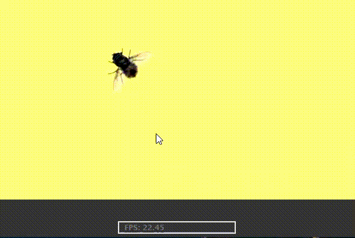

# Tracker_cv

Real-Time Object Tracker written in Python using OpenCV and Qt.

## Description

Simple real-time object Tracker based on OpenCv. Tracker uses a laptop camera. All important dependencies are given in the file `requirements.txt`.
